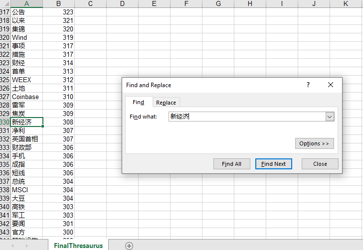
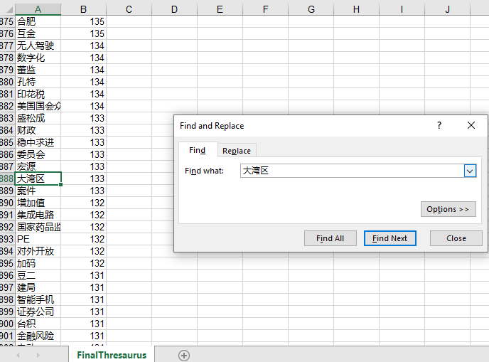

# LanguageProcessing

## Baidu API

### Static Speech Recognition

'voiceToText.py' is a simple approch to static speech recognition with Baidu Web API.
The voice source is from [THCHS-30](http://www.openslr.org/18/). I chose part of the speeches from [test-noise.tgz](http://www.openslr.org/resources/18/test-noise.tgz)/0db/car/.
The result is recorded in result.txt.

### Real-time Speech Recognition

'dynamicSpeechRecogniton.py' achieves simple real-time speech recognition using Baidu Web API. Due to time limit of wav file uploaded, I set time constraints to each recording (around 55 seconds). I use English Environment on my PC and there is some problem printing Unicode with Python, so I use 'speechScript.txt' to store the result of the recognition. The voice files are saved in history.

## iFLY API

It is similar to Baidu API, however, in order to use v2 version of speech recognition, websocket is needed to send wss request. Implementations are in 'webOperation.py'.
I always receive HTTP 401 when connecting to the server.

```shell
websockets.exceptions.InvalidStatusCode: server rejected WebSocket connection: HTTP 401
```

After debugging I found that there is some problem with the result of Hmac-sha256 of signature. Then I switched to 'wss.py'.
'wss.py' is only for testing. We can directly run 'voiceToText.py' and 'dynamicSpeechRecognition.py'.
For real-time speech recognition, I cannot get the output from the audio. I think it is because the volume of the record is too low. However, it works well with Baidu API.

## Finnacial Thesuarus

I implemented [Jieba](https://github.com/fxsjy/jieba) language processing package to fetch the keywords in the Excel files. I set constraints including leaving out puctuations and other useless characters. I also add user dictionary for improving the accuracy of detecting expected keywords like 'new economics'.
For executing the task, just need to run 'languageProcessing.py'.
The result is a set of keywords sorted by its frequencies. There are still some issues to be fixed. The results are saved in 'wordCount.txt' and 'wordCound.xls'. Although the algorithm can detect words like 'new economics' and 'Greate Bay Area', some of them are predefined in the user dictionary.
For instance:

 

After getting the result, we can draw an image of world cloud according to word frequencies ('generateWordCloud.py'):


__Some Reflection__:  I tried some frame works and packages which are new to me. They are really interesting. Besides barely using them, taking a deep look into the mechanism is also important. It will help to come up with a better plan and optimize the existing algorithms. For instance, my current algorithm have many flaws, sometimes it cannot seperate words correctly and some other words which are not related to finance are also included in the list. We may improve the it by increasing the sensitivity of vocabulary in finance.